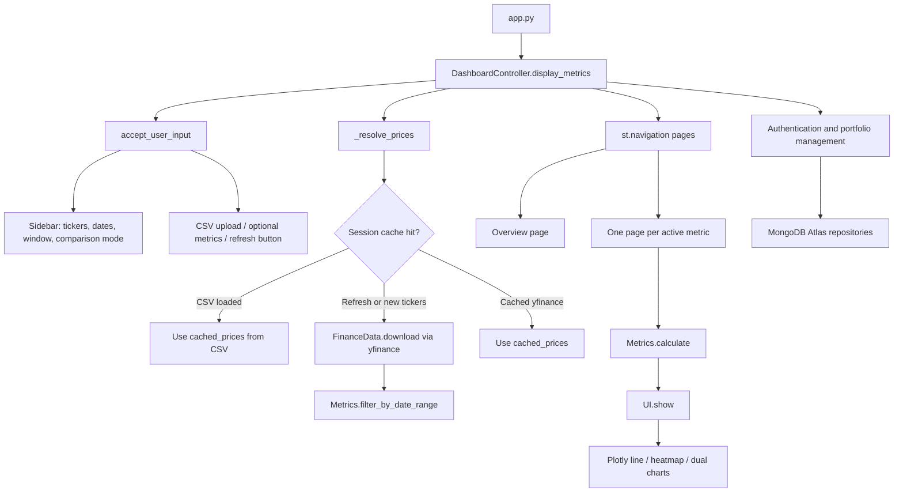

# AGENTS.md — Finance Dashboard

> **Maintenance rule:** Update this file on every code change. Add a changelog entry, refresh affected sections (architecture, files, metrics, session state, tests), and note any new assumptions or open work.

---

## Project summary

Streamlit finance dashboard that downloads stock prices from Yahoo Finance, optionally imports a CSV watchlist of tickers, computes metrics (volatility, comparison, correlation, etc.), and renders interactive Plotly charts. Uses a reactive controller pattern suited to Streamlit's rerun model.

**Stack:** Python 3.14 · Streamlit · yfinance · pandas · numpy · plotly · pymongo · scikit-learn · groq · pytest

---

## Quick start

```powershell
cd "C:\Users\Yelim\Downloads\Finance Dashboard Srikaran"
.\.venv\Scripts\Activate.ps1
streamlit run app.py
```

**Run tests:**

```powershell
.\.venv\Scripts\python.exe -m pytest tests/ -v
```

**Last reviewed:** 2026-07-16 — documentation aligned with the current controller flow, CSV watchlist behavior, and session-state usage

---

## Architecture

### High-level flow



### Design decisions

| Decision | Rationale |
|---|---|
| **Reactive orchestration** | Streamlit reruns the script on every widget change. `DashboardController` orchestrates sidebar → cache → compute → render; it is not a synchronous request/response API. |
| **Session-state caching** | Avoids re-downloading from Yahoo Finance on every slider/date change. |
| **Multi-page navigation** | `st.navigation` gives one sidebar page per metric plus an Overview page. |
| **MetricRegistry** | Decouples metric metadata (graph type, ticker requirements) from calculation logic. Optional metrics are toggled in the UI. |
| **Simple watchlist CSV** | CSV uploads are used as a lightweight ticker watchlist import. The app extracts valid symbols from the file rather than parsing historical price data. |
| **Repository boundary** | MongoDB Atlas persistence is accessed through repository adapters; in-memory adapters support local development and tests when `MONGODB_URI` is absent. |
| **Application authentication** | Users authenticate by email and scrypt-hashed password in main-page tabs; the signed-in user is held in Streamlit session state. |
| **Portfolio navigation** | Portfolio management is a dedicated navigation page; creation uses an explicit green action button rather than a selection option. Holding rows validate tickers, record whole-share quantities and purchase prices, show current profit/loss, and link back to the dashboard ticker view. |
| **Portfolio analysis** | The Analyze this portfolio expander reloads the selected portfolio, accepts a user-selected start/end date and volatility window, downloads that range, and delegates feature calculation, scaling, K-Means, and risk naming to `PortfolioAnalysis`. Clustering is skipped for 1–3 assets, uses up to 2 clusters for 4–5 assets, and up to 3 clusters for 6+ assets. Clustered portfolios are visualized as a return-versus-volatility scatter plot colored by risk group. |
| **LLM portfolio assistant** | `PortfolioAssistant` sends only application-owned holdings, prices, calculated metrics, and clustering results to Groq for explanation. Conversation messages are persisted per user and portfolio in MongoDB, with an in-memory fallback for local development. |

### Assumptions

- Tickers are Yahoo Finance symbols (US-style, e.g. `AAPL`, `MSFT`; international needs suffix e.g. `BMW.DE`).
- Portfolio analysis reports return and rolling daily-return volatility for the selected date range, with a default 21-day window.
- Stock comparison supports **normalized** (base 100), **raw prices**, or **both**.
- No API keys required (yfinance is free).
- Groq uses `GROQ_API_KEY` from `.streamlit/secrets.toml` or the environment. The model defaults in code, with an optional `GROQ_MODEL` environment-variable override; it is explanatory only and does not calculate financial values.
- PowerShell venv activation may require `Set-ExecutionPolicy RemoteSigned -Scope CurrentUser`.

---

## Project structure

```
Finance Dashboard Srikaran/
├── app.py                              # Streamlit entry point
├── requirements.txt                    # Python dependencies
├── AGENTS.md                           # This file — keep updated
├── finance_dashboard/
│   ├── __init__.py
│   ├── dashboard_controller.py         # Orchestration, session state, navigation
│   ├── finance_data.py                 # FinanceData — yfinance + CSV
│   ├── metrics.py                      # Metrics — all calculations
│   ├── metric_registry.py              # MetricDefinition + MetricRegistry
│   └── ui.py                           # UI — Plotly rendering
└── tests/
    └── test_metrics.py                 # Unit tests for Metrics + registry
```

---

### Added application modules

- `finance_dashboard/models.py` — User, Holding, and Portfolio document models
- `finance_dashboard/portfolio_repository.py` — MongoDB Atlas and in-memory repositories
- `finance_dashboard/portfolio_service.py` — Portfolio CRUD use cases
- `finance_dashboard/auth.py` — Signup/login password service
- `finance_dashboard/analysis.py` — Returns, volatility, clustering, and recommendations
- `finance_dashboard/portfolio_assistant.py` — Constrained Groq assistant and context serialization

## Core entities

### `FinanceData` (`finance_data.py`)

| Method | Purpose |
|---|---|
| `download(tickers, start, end)` | Fetch adjusted close prices from Yahoo Finance |
| `load_from_csv(uploaded_file)` | Parse a CSV watchlist and return unique ticker symbols |

Returns a `pd.DataFrame` indexed by date, one column per ticker.

### `Metrics` (`metrics.py`)

| Method | Returns | Notes |
|---|---|---|
| `filter_by_date_range(prices, start, end)` | `DataFrame` | User date filter |
| `calculate_rolling_volatility(series, window)` | `Series` | Annualized |
| `calculate_comparison(prices, mode)` | `DataFrame` | `mode`: `"normalized"` or `"raw"` |
| `calculate_correlation(prices)` | `DataFrame` | Return correlation matrix |
| `calculate_rolling_correlation(prices, a, b, window)` | `Series` | Pairwise rolling |
| `calculate_sharpe_ratio(series, window)` | `Series` | Optional metric |
| `calculate_cumulative_returns(prices)` | `DataFrame` | Optional metric |
| `calculate(metric_type, prices, ...)` | varies | Dispatcher; `"both"` comparison returns `dict` |

### `MetricRegistry` (`metric_registry.py`)

Defines `MetricDefinition` (name, graph_type, min_tickers, flags) and `MetricRegistry`:

- **Default metrics** (always active): Rolling Volatility, Stock Comparison, Correlation Matrix, Rolling Correlation
- **Optional metrics** (user enables in sidebar): Sharpe Ratio, Cumulative Returns
- `register(definition, calculator)` — extend with custom metrics (calculator hook reserved; dispatch currently lives in `Metrics.calculate`)

### `UI` (`ui.py`)

| Method | Purpose |
|---|---|
| `show(data, type_of_graph, title)` | Render line, heatmap, or dual charts (dict → stacked lines) |
| `show_summary_table(prices)` | Descriptive stats per ticker |
| `show_raw_data(prices)` | Dataframe display |
| `show_overview_cards(prices, tickers)` | `st.metric` cards on Overview page |

Graph types: `"line"`, `"heatmap"`.

### `DashboardController` (`dashboard_controller.py`)

Original spec mapping:

```
display_metrics()
  1. accept_user_input()   → UserInput dataclass from sidebar
  2. download_data()       → FinanceData.download (also updates session cache)
  3. calculate metrics     → Metrics.calculate via _render_metric_page
  4. show graph            → UI.show
```

| Method | Purpose |
|---|---|
| `accept_user_input()` | Sidebar widgets → `UserInput` |
| `download_data(list_of_stocks, start, end)` | Fetch and cache prices |
| `_resolve_prices(user_input)` | Cache-aware price loading + date filter |
| `_render_overview_page(user_input)` | Overview navigation page |
| `_render_metric_page(definition, user_input)` | Per-metric page |
| `display_metrics()` | Entry: sidebar → build `st.navigation` pages → `run()` |

### `UserInput` dataclass

| Field | Type | Source |
|---|---|---|
| `tickers` | `list[str]` | Comma-separated text area or CSV-loaded watchlist |
| `start_date`, `end_date` | `date` | Date inputs |
| `window` | `int` | Slider (5–90, default 21) |
| `comparison_mode` | `str` | `"normalized"` \| `"raw"` \| `"both"` |
| `enabled_optional_metrics` | `list[str]` | Multiselect in "Add features" |
| `volatility_ticker` | `str \| None` | Sidebar selection for the volatility page |
| `correlation_ticker_a`, `correlation_ticker_b` | `str \| None` | Sidebar selections for rolling correlation |
| `sort_ascending` | `bool` | Raw data sort order |
| `refresh_data` | `bool` | "Refresh market data" button |

---

## Session state keys

| Key | Type | Purpose |
|---|---|---|
| `cached_prices` | `pd.DataFrame` | Downloaded price data |
| `cached_tickers` | `list[str]` | Tickers in cache |
| `data_source` | `str` | `"none"` \| `"yfinance"` |
| `tickers_list` | `list[str]` | Current ticker list from the sidebar or CSV upload |
| `enabled_optional_metrics` | `list[str]` | Persisted optional metric selection |
| `current_user_input` | `UserInput` | Inputs for the active app rerun |
| `last_uploaded_file_id` | `str` | Name of the last uploaded CSV file to detect changes |
| `current_user` | `User` | Signed-in user for the current Streamlit session |
| `portfolio_analysis_<id>` | `dict` | Computed portfolio analysis snapshot retained across chat reruns |

Portfolio holdings are stored as ticker-keyed records with an integer `quantity` and a `purchase_price`. Legacy numeric holding values are read as quantities with a zero purchase price.

Portfolio analysis loads the selected date range, reports actual period return and rolling daily-return volatility, skips clustering for 1–3 assets, uses 2 K-Means clusters for 4–5 assets, and uses up to 3 clusters for 6 or more assets. Cluster labels are mapped to Low, Medium, or High Risk by cluster volatility.

Portfolio assistant conversations are keyed by user and portfolio, loaded from `portfolio_conversations`, and include prior messages when calling Groq. The assistant is limited to stock-market context and the supplied analysis snapshot.

**Cache invalidation:** Re-download when `refresh_data` is clicked, cache is empty, or tickers change (yfinance source only). CSV data persists until refresh or new upload.

---

## Navigation pages

| Page | Icon | Content |
|---|---|---|
| Overview | 📊 | Ticker cards, latest prices, metric list |
| Rolling Volatility | 📉 | Single-stock rolling vol chart |
| Stock Comparison | ⚖️ | Normalized / raw / both |
| Correlation Matrix | 🔥 | Heatmap |
| Rolling Correlation | 🔗 | Pairwise rolling correlation |
| Sharpe Ratio | 📐 | Optional — enable in sidebar |
| Cumulative Returns | 📈 | Optional — enable in sidebar |
| Portfolio Management | 💼 | Dedicated page for creating portfolios and editing, adding, or removing holdings |
| Portfolio management | | Create portfolios, edit/remove holdings, and save them to MongoDB when configured |

---

## Adding a new metric (checklist for agents)

1. Add calculation method to `Metrics` in `metrics.py`
2. Add `MetricDefinition` to `BUILTIN_METRICS` in `metric_registry.py` (set `enabled_by_default` as appropriate)
3. Add dispatch branch in `Metrics.calculate()`
4. Add icon mapping in `DashboardController.display_metrics()` if desired
5. Write tests in `tests/test_metrics.py`
6. Run `pytest tests/ -v`
7. **Update this file** (metrics table, changelog, navigation pages)

---

## Testing

| Test file | Covers |
|---|---|
| `tests/test_metrics.py` | Volatility, comparison modes, correlation, date filter, Sharpe, cumulative returns, registry, CSV loading (watchlist tickers) |
| `tests/test_portfolio_management.py` | Portfolio CRUD, authentication, portfolio return/volatility analysis, K-Means risk grouping, and empty/small portfolio safeguards |
| `tests/test_portfolio_management.py` | Also covers assistant context fidelity and in-memory conversation isolation |
| `finance_dashboard/ui.py` | Plotly rendering for portfolio risk-group scatter visualization |

**Convention:** Write tests before or alongside new metric logic. Run full suite before finishing.

---

## Open work / not yet implemented

- User-defined custom formulas (expression parser for ad-hoc metrics)
- Explicit "Clear CSV / switch to live data" control (refresh button partially covers this)
- Alternative data sources (Alpha Vantage, FRED, Bloomberg)
- `MetricRegistry.register()` calculator hook is defined but dispatch still centralized in `Metrics.calculate` — refactor if plugin-style metrics are needed
- Integration / Streamlit app tests (only unit tests exist today)
- Production session-token storage and password reset flow
- Mocked Groq API integration and Streamlit interaction tests

---

## Changelog

| Date | Author | Change |
|---|---|---|
| 2026-07-09 | Agent | Initial app: `FinanceData`, `Metrics`, `UI`, `DashboardController`, Streamlit entry, 6 unit tests |
| 2026-07-09 | Agent | Reactive session-state caching, `st.navigation` multi-page layout, comparison modes (normalized/raw/both), `MetricRegistry`, optional Sharpe Ratio + Cumulative Returns metrics, 11 unit tests |
| 2026-07-09 | Agent | Created `AGENTS.md` architecture handoff document |
| 2026-07-09 | Agent | Fixed `st.navigation` duplicate URL pathname error: replaced lambdas with named page runners + explicit `url_path` per metric page |
| 2026-07-16 | Antigravity | Verified codebase and confirmed all 11/11 tests pass successfully |
| 2026-07-16 | Antigravity | Added support for custom CSV date column selection, cached raw uploaded CSV data, and added unit tests (14/14 passing) |
| 2026-07-16 | Antigravity | Simplified CSV uploading to parse stock tickers only, moved configuration to the main page with a default 30-day range, and updated unit tests (13/13 passing) |
| 2026-07-16 | Copilot | Reviewed AGENTS.md against the current controller flow, CSV watchlist behavior, and session-state usage to keep the handoff notes accurate |
| 2026-09-02 | Copilot | Added MongoDB Atlas repositories, authenticated portfolio CRUD, returns, volatility, clustering, and similarity recommendations |
| 2026-09-02 | Copilot | Moved authentication to main-page tabs, isolated portfolio management as a navigation page, fixed portfolio creation, and preserved local fallback data across reruns |
| 2026-09-09 | Copilot | Added whole-share holding records with purchase prices and legacy holding deserialization |
| 2026-09-09 | Copilot | Added validated portfolio ticker entry, current-price profit/loss display, form reset, and ticker-to-dashboard navigation |
| 2026-09-09 | Copilot | Reset add-stock widget state before rerendering to prevent stale ticker values |
| 2026-09-09 | Copilot | Fixed ticker navigation to switch to the dynamic Overview page object instead of the unsupported app.py path |
| 2026-09-09 | Copilot | Added a historical price line chart to Overview for redirected ticker views |
| 2026-09-09 | Copilot | Implemented Analyze Portfolio metrics, scaled K-Means risk groups, asset-count safeguards, and Streamlit results rendering |
| 2026-09-16 | Copilot | Reloaded the selected portfolio before analysis, added empty market-data handling, and covered empty portfolio analysis |
| 2026-09-16 | Copilot | Added a Plotly return-versus-volatility scatter plot for portfolio risk groups |
| 2026-09-16 | Copilot | Added user-selected portfolio analysis dates and volatility window controls |
| 2026-09-16 | Copilot | Grouped portfolio analysis inputs and action inside a Streamlit expander |
| 2026-09-16 | Copilot | Changed portfolio analysis to report actual selected-period return and non-annualized volatility |
| 2026-09-23 | Copilot | Added constrained Groq portfolio assistant in Analyze portfolio, persisted MongoDB conversations with local fallback, and added secrets/dependency configuration and tests |
| 2026-09-23 | Copilot | Set the configurable Groq model default to `openai/gpt-oss-120b` |

---

## Handoff checklist for new agents

1. Read this file fully before editing
2. Activate venv and run tests to confirm baseline
3. Follow existing module boundaries — do not put calculations in `ui.py` or Streamlit calls in `metrics.py`
4. Match naming: `DashboardController`, `FinanceData`, `Metrics`, `UI`, `MetricRegistry`
5. After every change: update changelog + affected sections in this file
